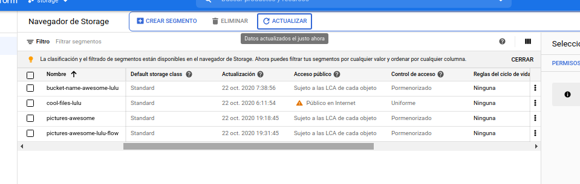

//Crear buckets por console de gc terminal

[Usando el cloud storage de google](https://cloud.google.com/nodejs/getting-started/using-cloud-storage?hl=es)

[Guardando información en gc - multer](https://cloud.google.com/nodejs/getting-started/using-cloud-storage?hl=es)

```
gsutil mb gs://buckect-name-awesome-lulu

gsutil defacl set public-read gs://buckect-name-awesome-lulu

output : Setting default object ACL on gs://buckect-name-awesome-lulu

```

1.- Utiliza los elementos de la pagina de google para actualizar la información
