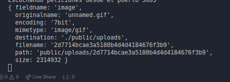

# Subir imagenes con node

## Herramientas

- UI : `Materialize css`
- views : `Engine - ejs`
- Gestion de images: `Multer`
- Server : `node`

## Modulo más popular MULTER para subir imagenes

[MULTER-S3](https://www.npmjs.com/package/multer-s3)
[PACKAGE MULTER](https://www.npmjs.com/package/multer)

## Aprendizajes
Multer es un middleware de note para subir archivos
al momento de que subes un file, te retorna la información de ese file
en el objeto `req.file`

Notas: 

[Multiples imagenes](https://stackabuse.com/handling-file-uploads-in-node-js-with-expres-and-multer/)
[Multiples imagenes](https://scotch.io/tutorials/express-file-uploads-with-multer)
[deply con heroku](https://devcenter.heroku.com/articles/s3-upload-node)